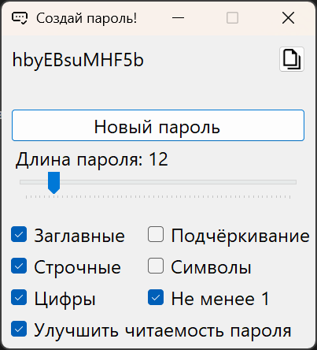

# Генератор паролей от OliveWizard

## Описание
Программа для генерации уникальных криптостойких паролей длиной от 6 до 64 символов с различными параметрами:
+ Строчные или заглавные буквы
+ Цифры
+ Дефис и нижнее подчеркивание
+ Специальные символы

Дополнительно можно отметить обязательность появления хотя бы одного символа из выбранных категорий и исключить похожие друг на друга или сложночитаемые символы.

## Системные требования
| Файл  | ОС | .NET | ПЗУ |
| ------------- | ------------- | ------------- | ------------- |
| PassGen.exe | Windows 10 x64 1607 и новее | [.Net 10](https://dotnet.microsoft.com/ru-ru/download) (любой вариант) | < 0.5 Мб |
| PassGen.7z | Windows 10 x64 1607 и новее | - | ~ 120 Мб |

### [Скачать программу](https://github.com/OneCodeUnit/PassGen/releases/latest)

## Сборка из исходников
Запустить скрипт:
+ !publish.bat - версия программы, требующая .NET
+ !publishNoNet.bat - версия программы, НЕ требующая .NET

## Безопасность

### Криптографическая стойкость
PassGen использует `System.Security.Cryptography.RandomNumberGenerator` - криптографически стойкий генератор случайных чисел, рекомендованный Microsoft для генерации паролей и ключей.

### Энтропия
Энтропия пароля зависит от его длины и размера алфавита:

| Длина пароля | Только цифры (10) | Буквы (52) | Буквы + Цифры (62) | Все символы (94) | Улучшение читаемости (45) |
|--------------|-------------------|------------|--------------------|-----------------|--------------------|
| **6**        | 19.93 бит         | 34.20 бит  | 35.75 бит         | 39.46 бит       | 32.55 бит         |
| **12**       | 39.86 бит         | 68.41 бит  | 71.50 бит         | 78.93 бит       | 65.10 бит         |
| **16**       | 53.15 бит         | 91.21 бит  | 95.33 бит         | 105.23 бит      | 86.80 бит         |
| **24**       | 79.73 бит         | 136.81 бит | 143.00 бит        | 157.85 бит      | 130.20 бит        |
| **32**       | 106.30 бит        | 182.42 бит | 190.66 бит        | 210.46 бит      | 173.60 бит        |
| **64**       | 212.61 бит        | 364.83 бит | 381.33 бит        | 420.92 бит      | 347.20 бит        |

#### Интерпретация энтропии

| Энтропия | Сила пароля |
|----------|-------------|
| **< 60 бит** | 🔴 Слабый |
| **60-90 бит** | 🟠 Средний |
| **< 90 бит** | 🟢 Сильный |

**Рекомендация:** Для максимальной безопасности используйте:
- Длину **не менее 16 символов**
- Все категории символов (заглавные, строчные, цифры, спецсимволы)
- Опцию **"Не менее 1"** для гарантии присутствия всех категорий
- Уникальные пароли для каждого сервиса

**Важно:** Даже надёжный пароль не защитит от:
- Фишинговых атак
- Утечек данных
- Вредоносного ПО
- Социальной инженерии

## Использование

### Графический интерфейс

1. **Выберите категории символов**:
   - ☑️ **Заглавные** (A-Z)
   - ☑️ **Строчные** (a-z)
   - ☑️ **Цифры** (0-9)
   - ☑️ **Подчёркивание** (-, _)
   - ☑️ **Символы** (!@#$%^&* и др.)

2. **Настройте дополнительные параметры**:
   - ☑️ **Не менее 1** — обязательное наличие символов из каждой категории
   - ☑️ **Улучшить читаемость пароля** — исключить визуально похожие символы (0/O, 1/l/I, и т.д.)

3. **Выберите длину** пароля с помощью ползунка (6-64 символа)

4. **Нажмите "Новый пароль"** для генерации нового пароля. Он так же создаётся при изменении параметров.

5. **Скопируйте** пароль нажав на него или кнопку 

